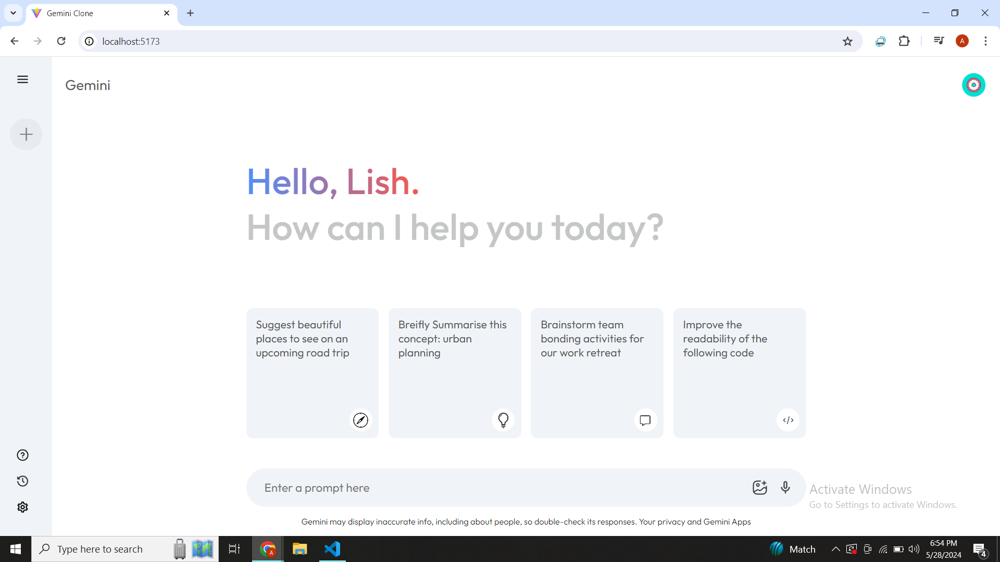

# Gemini 2.0 Clone

## Overview

Gemini 2.0 Clone is a web application that replicates the functionality of the Gemini 2.0 platform. It allows users to explore and interact with content in the Gemini ecosystem. This clone provides a user-friendly interface and incorporates the core features of the Gemini platform.

## Features

- **Content Exploration**: Browse and discover content from various sources within the Gemini ecosystem.
- **Search Functionality**: Search for specific content using keywords.
- **API Integration**: Utilizes the Gemini API to fetch and display content in real-time.

## Technologies Used

- **Frontend**:
  - React: Frontend development framework.

- **Backend**:
  - Node.js: Backend runtime environment.

## API Integration

The Gemini 2.0 Clone integrates with the Gemini API to fetch and display content. The API provides endpoints for retrieving content metadata, and interaction functionalities. By leveraging the Gemini API, the clone ensures real-time updates and seamless integration with the Gemini platform.

## Getting Started

To run the Gemini 2.0 Clone locally, follow these steps:

1. Clone this repository.
2. Navigate to the project directory.
3. Start the server using `npm run dev`.

